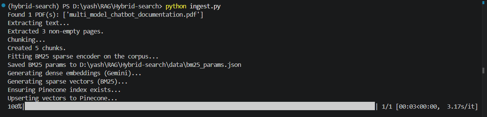

# Hybrid Search RAG

A Retrieval-Augmented Generation system that combines **dense (semantic)** and **sparse (keyword/BM25)** search for more accurate retrieval, with a Cohere reranking step before the final LLM answer.

```
PDF → Extract Text → Chunk → Dense Embeddings (Gemini) + Sparse Vectors (BM25)
    → Pinecone Hybrid Search → Top 20 → Cohere Rerank → Top 5 → Gemini → Answer
```

## Tech Stack

| Component         | Tool                                 |
| ----------------- | ------------------------------------ |
| PDF parsing       | PyMuPDF                              |
| Chunking          | LangChain Text Splitter              |
| Dense embeddings  | Google Gemini (`text-embedding-004`) |
| Sparse embeddings | BM25 (`rank-bm25`)                   |
| Vector DB         | Pinecone (hybrid / dotproduct index) |
| Reranking         | Cohere Rerank (`rerank-v3.5`)        |
| LLM               | Google Gemini (`gemini-2.5-flash`)   |

## Project Structure

```
Hybrid-search/
│   app.py              # interactive CLI chat loop
│   config.py            # all settings, models, API keys
│   ingest.py            # PDF → Pinecone ingestion pipeline
│   query.py             # single-question query pipeline
│   requirements.txt
│   .env                 # API keys (not committed)
│
├───data/                # put your source PDFs here
├───notebooks/            # scratch / experiments
├───prompts/
│       rag_prompt.txt    # RAG prompt template
└───utils/
        pdf_loader.py     # PDF text extraction
        chunker.py        # text chunking
        embeddings.py     # Gemini dense embeddings
        sparse_encoder.py # BM25 sparse vectors
        pinecone_db.py    # Pinecone index + hybrid scaling
        retriever.py       # hybrid search
        reranker.py        # Cohere reranking
        prompt_builder.py  # prompt assembly
        llm.py             # Gemini answer generation
```

## Setup

**1. Install dependencies**

```bash
pip install -r requirements.txt
```

**2. Configure API keys**

Copy your keys into `.env`:

```env
GOOGLE_API_KEY=your_google_api_key_here
PINECONE_API_KEY=your_pinecone_api_key_here
PINECONE_INDEX_NAME=hybrid-search-rag
PINECONE_CLOUD=aws
PINECONE_REGION=us-east-1
COHERE_API_KEY=your_cohere_api_key_here
```

**3. Add a PDF**

Drop one or more `.pdf` files into the `data/` folder.

## Usage

**Ingest documents into Pinecone**

```bash
python ingest.py
```

This extracts text, chunks it, generates dense + sparse vectors, and upserts everything into Pinecone. Run this once per PDF batch you add.

<p align="center">
  
</p>

**Ask a question**

```bash
python app.py
```

or for a single one-shot query:

```bash
python query.py
```

<p align="center">
  
</p>

## How Hybrid Search Works

Pinecone doesn't auto-balance dense vs. sparse scores — this project scales both before querying using an `alpha` weight (`config.py`):

- `ALPHA = 1.0` → pure semantic (dense) search
- `ALPHA = 0.0` → pure keyword (BM25) search
- `ALPHA = 0.5` → balanced hybrid (default)

The BM25 encoder is **fit once during ingestion** and saved to `data/bm25_params.json`, so query-time sparse vectors stay consistent with what was indexed.

## Configuration

All tunables live in `config.py`:

| Setting         | Default | Description                     |
| --------------- | ------- | ------------------------------- |
| `CHUNK_SIZE`    | 1000    | characters per chunk            |
| `CHUNK_OVERLAP` | 150     | overlap between chunks          |
| `TOP_K_DENSE`   | 20      | candidates pulled from Pinecone |
| `TOP_K_RERANK`  | 5       | chunks kept after reranking     |
| `ALPHA`         | 0.5     | dense/sparse hybrid weight      |

## Notes

- This is a working prototype, not a production hardened service — there's no retry/backoff on API calls and no async batching.
- Re-running `ingest.py` on the same PDFs will upsert duplicate IDs as new versions (same `chunk_id` = overwrite, so it's safe to re-run).
- If you change `EMBEDDING_MODEL` to one with a different output dimension, you'll need to delete and recreate the Pinecone index.
